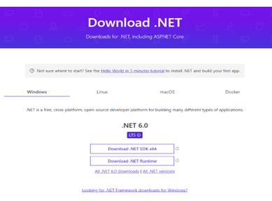
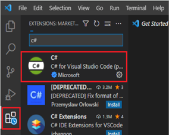

# **T**witter Sentiment Analysis Workshop

# Pre-settings:

1. Internet
2. Azure Suusbcrition (Eductation)
3. Twitter developer account
4. Postman
5. Visual Studio Code
6. .NET 6 SDK

# Steps to do this Workshop:

## 1. **Create a Twitter develper account**

To enable developer functions on a twitter account, you need to create a developer account, and follow the next steps.

- **Step 1:** Go to URL: https://developer.twitter.com/en/apply-for-access

- **Step 2:** Sign in with your Twitter account, this will use to bind access to the developer portal.

- **Step 3:** Fill in the following information requested by the form:

  - Name

  - Country

  - Use Case (for this workshop, select study)

  - Choose **No** to the option &quot;Will you make Twitter content or derived information available to a government entity or a government affiliated entity?&quot;

    

By submitting this form, you will need to wait for Twitter's approval for this access. It is important to complete this process before attending the workshop

## 2. **Installl .Net 6.0 SDK and VS Code**

This is a guide to install the .Net 6.0 SDK and Visual Studio Code. and cofigure your environment to use the SDK and Code.

Esta es una guía paso a paso para programadores principiantes, intermedios y experimentados para configurar el entorno y crear aplicaciones .net con Visual Studio Code + C# 10 y .net 6.0

Lets begin by installing the .Net 6.0 SDK.

- **Step 1** - Download .net 6 SDK from oficial site [here](https://dotnet.microsoft.com/en-us/download).

    

- **Step 2** – Choose your operating system and click on the option corresponding to your processor architecture.

    

- **Step 3** – open the download file and complete the install steps.

    

- **Step 4** - Now check the installed version, for that we will use the following command.
    
    ``` dotnet --info```
    
    

- **Step 5** - Install Visual Studio Code from [here](https://code.visualstudio.com/download)

    


- **Step 6** - Install C# from [here](https://marketplace.visualstudio.com/items?itemName=ms-dotnettools.csharp)

    


- **Step 7** - Another way you can install C# is by using VS Code extension manager, finding the extension, and install

    

    Now C# is installed, in our environment it is ready to use. Now we can create a new dotnet project using Visual Studio Code + .net 6 and C# 10.

## 3. **Steps to create text analytics service in Azure**

Para crear un servicio de análisis de texto en Azure, es necesario lo siguiente

- An Azure account
- Preferably this account has credits (early features or many operations per second)

Steps to create:

1. Go to Azure portal page [https://portal.azure.com](https://portal.azure.com/), in the search bar type cognitive services y and select the result with the same name

    

2. Now at language section, you choose language service and click on create, this will open a new page with the form to create the service.

    

3. On this page, you can choose additional features such as custom question answering and custom text classification & custom named entity recognition. 
   
    

4. In the create form follow the instructions, select the subscription, the resource group (if you don't have one, create one).
5. Select the region (Not all regions have all services and the price changes for each one).
6. Enter the name of the service and select the tariff plan, if the free plan is available (F0) select it (this applies only for the first service), if you have more than one, the standard plan applies, if you selected any of the additional features, you must select the region of the search service and select the free plan F.
7. Click review and create and wait for the resource to be created.
   
   

## 4. **Steps to create a project on VS Code**

Before starting with the creation of our application we must create the folder that will store our code, after doing this we select our new folder and right click and select the &quot;option open with code&quot;, where a new instance of VSCode.

Next step to create our project we are going to use the integrated command console of Visual Studio Code which we place in the lower left part of the application window.


In the terminal tab enter the following command:

```dotnet new web```

This command will create the minimum files that our application must have, which is already functional, and we can test with the command

```c# 
dotnet run
Building...
info: Microsoft.Hosting.Lifetime[14]
Now listening on: https://localhost:7265
info: Microsoft.Hosting.Lifetime[14]
Now listening on: http://localhost:5059
info: Microsoft.Hosting.Lifetime[0]
Application started. Press Ctrl+C to shut down.
info: Microsoft.Hosting.Lifetime[0]
Hosting environment: Development
info: Microsoft.Hosting.Lifetime[0]
Content root path: C:\Users\david.rodriguezp\Projects\DemoWorkshop\
```

Once this command is executed, our application will be up and running and the application is working with 2 URLs, which are highlighted in the previous text, one for http and one for https.

**Notice:** It should be noted that these URLs are random, so they will be different in each case.

Now that we have verified that our application works, we are going to use the following packages in our project that will allow us to interact with the different components of the application:

- **Azure.AI.TextAnalytics v.5.2.0-beta.2** : It will allow us to interact with our text analysis service.
- **Swashbuckle.AspNetCore v.**** 6.2.3**: It will provide us with a test interface for our application.
- **TweetinviAPI v.5.0.4** : It will allow us to interact with the Twitter development APIs.

To use them in our project we must execute the following commands in the VS Code terminal to install them.

```c#
dotnet add package Azure.AI.TextAnalytics -v 5.2.0-beta.2
dotnet add package Swashbuckle.AspNetCore -v 6.2.3
dotnet add package TweetinviAPI -v 5.0.4
```

Now in the Program.cs file of our project we are going to add the following lines to support the swagger that will be in charge of helping us to test the endpoints that we are building, I will leave the complete code fragment to replace the complete content of the file:

```c#    
using Microsoft.OpenApi.Models;
	 
var builder = WebApplication.CreateBuilder(args);
builder.Services.AddEndpointsApiExplorer();
builder.Services.AddSwaggerGen(options =>
{
    options.SwaggerDoc("v1", new OpenApiInfo { Title = "Demo TextAnalytics Api", Version = "v1" });
});

```

If we replace the content of our Program.cs file with the previous text, we run the application with the dotnet run command where if we visit the URL https://localhost:xxxx/swagger in the browser we will see that the functionality is already implemented to be able to test and document our endpoints.


The following steps are described in the development of the workshop.